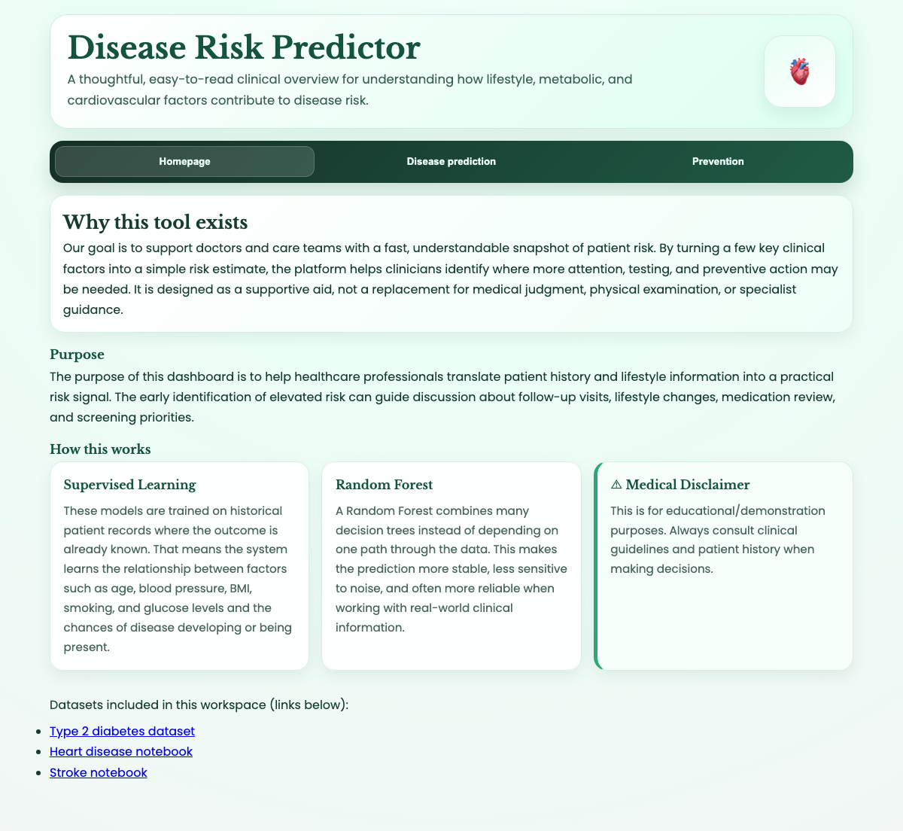

# Disease Risk Predictor

A minimal full-stack ML web app that estimates risk for multiple diseases (Type 2 diabetes, heart disease, stroke) from health metrics using Random Forest classifiers.

## Project Background

This project was created as a proof-of-concept to demonstrate how machine learning can be applied to clinical risk prediction in a simple, accessible web interface. The goal is to showcase the complete pipeline from data to deployment across multiple disease models:

- **Multiple disease models**: Type 2 diabetes, heart disease, and stroke prediction
- **Data ingestion** from Kaggle datasets (≈100K+ patient records per disease)
- **Model training** using scikit-learn's Random Forest algorithm
- **Web deployment** with a clean, responsive UI for clinicians and patients
- **Real-time prediction** via a REST API with disease-specific features
- **Tabbed interface** to switch between disease predictions seamlessly

The project prioritizes simplicity and clarity over complexity, avoiding unnecessary abstractions and focusing on working, deployable code.

## Screenshots



## Setup

```bash
pip install -r requirements.txt
```

## Dataset

Download the dataset from Kaggle:
https://www.kaggle.com/datasets/iammustafatz/diabetes-prediction-dataset

Place the CSV at:
```
data/diabetes_prediction_dataset.csv
```

## Train the model

```bash
python3 train_model.py
```

This prints accuracy and saves `models/diabetes_model.pkl`.

## Run the app

```bash
python3 app.py
```

Open http://localhost:5002 in your browser.

The interface includes three tabs:
- **Homepage**: Project overview and explanations of supervised learning & Random Forest
- **Disease prediction**: Toggle between Type 2 diabetes, heart disease, and stroke with disease-specific forms
- **Prevention**: Tips for reducing disease risk

## Project structure

```
project/
├── app.py                      # Flask backend + prediction endpoints
├── train_model.py              # Model training script (diabetes)
├── requirements.txt
├── README.md
├── .gitignore
├── models/
│   ├── diabetes_model.pkl      # Diabetes model (generated by train_model.py)
│   ├── heart_model.pkl         # Heart disease model (optional)
│   └── stroke_model.pkl        # Stroke model (optional)
├── data/
│   ├── diabetes_prediction_dataset.csv
│   ├── heart.csv
│   └── healthcare-dataset-stroke-data.csv
├── templates/
│   └── index.html
├── static/
│   └── style.css
└── docs/
    └── screenshot.png
```

## How it works

1. `train_model.py` loads the CSV, encodes categoricals, trains a `RandomForestClassifier`, and saves the model + encoders with `joblib`.
2. `app.py` loads the saved model and exposes a `/predict` POST endpoint that returns a risk percentage via `predict_proba()`.
3. The frontend sends form data as JSON and renders the risk percentage with a Low / Medium / High label.

## Machine Learning Models

The app supports three disease prediction models, all using Random Forest classifiers:

### Type 2 Diabetes
- **Dataset**: ~100K patient records from Kaggle diabetes prediction dataset
- **Features**: Age, gender, BMI, hypertension, heart disease, smoking history, HbA1c level, blood glucose
- **Model status**: ✅ Trained and included
- **Clinical focus**: Metabolic factors (glucose control, BMI) and lifestyle (smoking, hypertension)

### Heart Disease
- **Dataset**: ~1K records from UCI Heart Disease dataset
- **Features**: Age, gender, chest pain type, resting blood pressure, cholesterol, max heart rate, exercise-induced angina, ST depression, slope, major vessels, thalassemia
- **Model status**: ✅ Available (if `models/heart_model.pkl` exists)
- **Clinical focus**: Cardiac risk factors (blood pressure, cholesterol, exercise tolerance)

### Stroke
- **Dataset**: ~5K records from healthcare stroke prediction dataset
- **Features**: Age, gender, hypertension, heart disease, ever married, work type, residence type, average glucose level, BMI, smoking status
- **Model status**: ✅ Available (if `models/stroke_model.pkl` exists)
- **Clinical focus**: Neurological risk indicators (glucose, hypertension, heart disease)

## Algorithm: Random Forest Classifier

**Why Random Forest?**
- **Robust & generalizable**: Multiple decision trees reduce overfitting and noise in clinical data
- **Non-linear patterns**: Captures complex relationships between health metrics better than linear models
- **Feature importance**: Interpretable feature weights help understand which inputs matter most
- **Probability calibration**: `predict_proba()` provides confidence scores (0–1) for smooth risk gradients
- **No scaling required**: Works directly with raw numeric and categorical features

### Model Architecture

```
RandomForestClassifier(
    n_estimators=100,      # 100 decision trees voting on outcome
    random_state=42        # Reproducible results
)
```

Each tree learns different splits of the feature space, and the ensemble averages predictions for stability.

### Training Process

1. **Load data**: Patient records from Kaggle dataset
2. **Encode categoricals**: LabelEncoder for categorical features
3. **Train/test split**: 80/20 split for unbiased evaluation
4. **Model training**: Fit ensemble on training data
5. **Evaluation**: Report accuracy on held-out test set
6. **Serialization**: Save model + encoders with `joblib` for production use

### Feature Example: Type 2 Diabetes

| Feature | Type | Range | Clinical Significance |
|---------|------|-------|----------------------|
| age | numeric | 1–120 years | Risk increases with age |
| gender | categorical | Male/Female/Other | Sex-specific risk patterns |
| bmi | numeric | 10–70 | Obesity is a major risk factor |
| hypertension | binary | 0/1 | High blood pressure accelerates disease |
| heart_disease | binary | 0/1 | Comorbidity indicator |
| smoking_history | categorical | never/former/current/etc | Smoking damages metabolic health |
| HbA1c_level | numeric | 3–15% | Glycemic control indicator |
| blood_glucose_level | numeric | 50–400 mg/dL | Direct glucose measurement |

### Risk Classification

All models output a probability (0–1) which is converted to a percentage and categorized:

- **Low risk**: < 30%
- **Medium risk**: 30–60%
- **High risk**: ≥ 60%

## Disclaimer

This tool is for educational purposes only and is not a substitute for professional medical advice.
